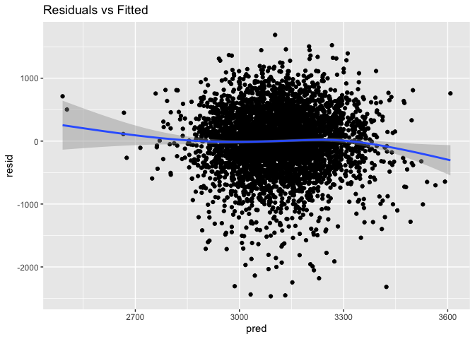

p8105_hw6_cy2751
================
Congyu Yang
2024-11-24

## Problem 1

## Problem 2

``` r
homicide <- read_csv("data/homicide-data.csv")%>% 
  mutate(city_state = str_c(city,state,sep = ", "),
         status = ifelse(disposition == "Closed by arrest",1,0)) %>% 
  filter((city_state != "Tulsa, AL") & (city_state != "Dallas, TX")
         & (city_state != "Phoenix, AZ") & 
           (city_state != "Kansas City, MO")) %>% 
  filter((victim_race == "White") | (victim_race == "Black")) %>% 
  mutate(victim_age = as.numeric(case_when(victim_age == "Unknown" ~ NA,
                                .default = victim_age)),
         victim_race = fct_relevel(victim_race, "White")) %>% 
  filter(victim_sex != "Unknown")
```

    ## Rows: 52179 Columns: 12
    ## ── Column specification ────────────────────────────────────────────────────────
    ## Delimiter: ","
    ## chr (9): uid, victim_last, victim_first, victim_race, victim_age, victim_sex...
    ## dbl (3): reported_date, lat, lon
    ## 
    ## ℹ Use `spec()` to retrieve the full column specification for this data.
    ## ℹ Specify the column types or set `show_col_types = FALSE` to quiet this message.

``` r
baltimore_df <- homicide %>% 
  filter(city == "Baltimore")

city_name_bal <- homicide %>% distinct(city_state) %>% 
  filter(city_state == "Baltimore, MD")

(fit_logistic_bal <- 
  baltimore_df %>%  
  glm(status ~ victim_age + victim_race + victim_sex, data = ., family = binomial()))
```

    ## 
    ## Call:  glm(formula = status ~ victim_age + victim_race + victim_sex, 
    ##     family = binomial(), data = .)
    ## 
    ## Coefficients:
    ##      (Intercept)        victim_age  victim_raceBlack    victim_sexMale  
    ##         1.151737         -0.006727         -0.841756         -0.854463  
    ## 
    ## Degrees of Freedom: 2752 Total (i.e. Null);  2749 Residual
    ## Null Deviance:       3568 
    ## Residual Deviance: 3493  AIC: 3501

``` r
(OR_bal <- fit_logistic_bal %>%  
  broom::tidy() %>% 
  filter(term == "victim_sexMale") %>% 
  mutate(OR = exp(estimate),
         CI_low = exp(estimate - 1.96 * std.error),
         CI_high = exp(estimate + 1.96 * std.error)) %>% 
  select(OR, CI_low,CI_high) %>%
  mutate(city_state = city_name_bal) %>% 
  unnest() %>% select(city_state,everything()) %>% 
  knitr::kable(digits = 3))
```

    ## Warning: `cols` is now required when using `unnest()`.
    ## ℹ Please use `cols = c(city_state)`.

| city_state    |    OR | CI_low | CI_high |
|:--------------|------:|-------:|--------:|
| Baltimore, MD | 0.426 |  0.325 |   0.558 |

``` r
est_and_CI <- function(x){
  
  city_df <- homicide %>% 
    filter(city_state == x)
  
  city_name_all <- homicide %>% distinct(city_state) %>% 
    filter(city_state == x)
  
  fit_logistic_all <- city_df %>%  
    glm(status ~ victim_age + victim_race + victim_sex, data = ., family =
        binomial())
  
  OR_all <- fit_logistic_all %>%  
    broom::tidy() %>% 
    filter(term == "victim_sexMale") %>% 
    mutate(OR = exp(estimate),
          CI_low = exp(estimate - 1.96 * std.error),
          CI_high = exp(estimate + 1.96 * std.error)) %>% 
    select(OR, CI_low,CI_high) %>%
    mutate(city_state = city_name_all) %>% 
    unnest() %>% select(city_state,everything()) 
  
  OR_all
}

city_states_name <- homicide %>% distinct(city_state) %>% pull(city_state)


(OR_table_all <- map_dfr(city_states_name, \(x) est_and_CI(x)))
```

    ## # A tibble: 47 × 4
    ##    city_state         OR CI_low CI_high
    ##    <chr>           <dbl>  <dbl>   <dbl>
    ##  1 Albuquerque, NM 1.77   0.831   3.76 
    ##  2 Atlanta, GA     1.00   0.684   1.46 
    ##  3 Baltimore, MD   0.426  0.325   0.558
    ##  4 Baton Rouge, LA 0.381  0.209   0.695
    ##  5 Birmingham, AL  0.870  0.574   1.32 
    ##  6 Boston, MA      0.667  0.354   1.26 
    ##  7 Buffalo, NY     0.521  0.290   0.935
    ##  8 Charlotte, NC   0.884  0.557   1.40 
    ##  9 Chicago, IL     0.410  0.336   0.501
    ## 10 Cincinnati, OH  0.400  0.236   0.677
    ## # ℹ 37 more rows

``` r
OR_table_all %>% 
  mutate(city_state = reorder(city_state, OR)) %>%
  ggplot(aes(x = city_state, y = OR)) +
  geom_errorbar(aes(ymin = CI_low, ymax = CI_high)) +
    geom_point()+
  theme(axis.text.x = element_text(size = 5,angle = 90,hjust = 1))+
  ggtitle("Odds Ratio for Solving homicides among sex")
```

<!-- -->

The plot shows the odds ratio for solving homicides between different
sexes. We can see most of the cities have odds ratio less than 1, which
means female victims are more likely to be solved by arrest than male
victims.  
For cities like Tulsa and Atlanta, they have odds ratio close to 1,
which means there is almost no difference between the likelihood of
solving homicides among different genders. In cities such as New York
and Cincinnati, their odds ratios are smaller than 1, showing a trend
that homicides involving female victims might be slightly more likely to
be solved by arrest. For cities that have wide range of confidence
interval, it means the dataset for this city may not be large enough or
there is a higher variability inside the dataset.

## Problem 3

``` r
bwt_df <- 
  read_csv("data/birthweight.csv") %>% 
  janitor::clean_names() %>% 
  mutate(babysex = case_match(babysex,
                              1 ~ "male",
                              2 ~ "female"),
         babysex = fct_infreq(babysex),
         frace = case_match(frace,
                            1 ~ "white",
                            2 ~ "black",
                            3 ~ "asian",
                            4 ~ "puerto rican",
                            8 ~ "other",
                            9 ~ "unknown"),
         frace = fct_infreq(frace),
         mrace = case_match(mrace,
                            1 ~ "white",
                            2 ~ "black",
                            3 ~ "asian",
                            4 ~ "puerto rican",
                            8 ~ "other"),
         mrace = fct_infreq(mrace),
         malform = as.logical(malform)) %>% 
  drop_na()
```

    ## Rows: 4342 Columns: 20
    ## ── Column specification ────────────────────────────────────────────────────────
    ## Delimiter: ","
    ## dbl (20): babysex, bhead, blength, bwt, delwt, fincome, frace, gaweeks, malf...
    ## 
    ## ℹ Use `spec()` to retrieve the full column specification for this data.
    ## ℹ Specify the column types or set `show_col_types = FALSE` to quiet this message.

``` r
fit <-  lm(bwt ~ menarche + mheight + momage, data = bwt_df)

summary(fit)
```

    ## 
    ## Call:
    ## lm(formula = bwt ~ menarche + mheight + momage, data = bwt_df)
    ## 
    ## Residuals:
    ##      Min       1Q   Median       3Q      Max 
    ## -2466.24  -276.38    25.19   317.69  1688.24 
    ## 
    ## Coefficients:
    ##             Estimate Std. Error t value Pr(>|t|)    
    ## (Intercept)  798.509    188.300   4.241 2.28e-05 ***
    ## menarche     -20.877      5.208  -4.008 6.22e-05 ***
    ## mheight       35.251      2.869  12.287  < 2e-16 ***
    ## momage        16.699      1.991   8.387  < 2e-16 ***
    ## ---
    ## Signif. codes:  0 '***' 0.001 '**' 0.01 '*' 0.05 '.' 0.1 ' ' 1
    ## 
    ## Residual standard error: 498.4 on 4338 degrees of freedom
    ## Multiple R-squared:  0.05377,    Adjusted R-squared:  0.05312 
    ## F-statistic: 82.17 on 3 and 4338 DF,  p-value: < 2.2e-16

``` r
fit %>%  
  broom::tidy() %>%  
  select(term, estimate, p.value)
```

    ## # A tibble: 4 × 3
    ##   term        estimate  p.value
    ##   <chr>          <dbl>    <dbl>
    ## 1 (Intercept)    799.  2.28e- 5
    ## 2 menarche       -20.9 6.22e- 5
    ## 3 mheight         35.3 3.92e-34
    ## 4 momage          16.7 6.67e-17

Since baby’s birth weight is no doubt related to mother, so I choose to
model birth weight based on mother’s body condition: mother’s age at
menarche, mother’s age at delivery and mother’s height.

``` r
bwt_df %>% 
  select(bwt,menarche, mheight, momage) %>% 
  add_residuals(fit) %>% 
  add_predictions(fit) %>% 
  ggplot(aes(x = pred,y = resid))+
  geom_point()+
  ggtitle("Residuals vs Fitted")
```

<!-- -->

``` r
fit_2 <- lm(bwt ~ blength + gaweeks, data = bwt_df)
```

``` r
fit_3 <- lm(bwt ~ bhead * blength * babysex, data = bwt_df)
```

``` r
cv_df <-
  crossv_mc(bwt_df, 100) %>%  
  mutate(
    train = map(train, as_tibble),
    test = map(test, as_tibble))

cv_df_2 <- 
  cv_df %>%  
  mutate(
    fit = map(train, \(df) lm(bwt ~ menarche + mheight + momage, data = df)),
    fit_2 = map(train, \(df) lm(bwt ~ blength + gaweeks, data = bwt_df)),
    fit_3 = map(train, \(df) lm(bwt ~ bhead * blength * babysex, data = bwt_df))) %>%  
  mutate(
    rmse_fit = map2_dbl(fit, test, \(mod, df) rmse(model = mod, data = df)),
    rmse_fit2 = map2_dbl(fit_2, test, \(mod, df) rmse(model = mod, data = df)),
    rmse_fit3 = map2_dbl(fit_3, test, \(mod, df) rmse(model = mod, data = df)))
```

``` r
cv_df_2 %>%  
  select(starts_with("rmse")) %>%  
  pivot_longer(
    everything(),
    names_to = "model", 
    values_to = "rmse",
    names_prefix = "rmse_") %>%  
  mutate(model = fct_inorder(model)) %>%  
  ggplot(aes(x = model, y = rmse)) + geom_violin()
```

<!-- -->

Since all three models are linear, they are almost the same on
complexity with goodness of fit and interpretability. Accordingly, the
third model: the one using head circumference, length, sex and all
interactions has the lowest rmse wins.
